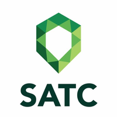

# infosatc-lp-04
<h2>Atividades da disciplina de linguagem de programação do curso técnico de informática SATC 2020
# infosatc-lp-avaliativo-01</h2

Técnico de Informatica

Linguagem de Programação

2020

Exercicios avaliativos, com base nas ativdades anteriores, concluidos conforme socitado pela professora Francine Cardoso

Pyton

<a href="https://github.com/Realdo-Justino/infosatc-lp-04/blob/master/exercicio-01.py">Exercicio-01</a>

<a href="https://github.com/Realdo-Justino/infosatc-lp-04/blob/master/exercicio-02.py">Exercicio-02</a>

<a href="https://github.com/Realdo-Justino/infosatc-lp-04/blob/master/exercicio-03.py">Exercicio-03</a>

<a href="https://github.com/Realdo-Justino/infosatc-lp-04/blob/master/exercicio-04.py">Exercicio-04</a>

<a href="https://github.com/Realdo-Justino/infosatc-lp-04/blob/master/exercicio-05.py">Exercicio-05</a>